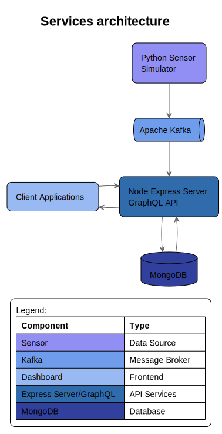

# AirQualityInsight

Simulation project of a sensor system to monitor air quality, with data sent to a server for real-time analysis and visualization.

The system simulates a network of sensors, such as Raspberry Pi, capable of measuring air quality. These measurements will be sent to a server, which will analyze them and present the data in real-time on a dedicated dashboard.

The measured data includes: CO2, PM10 and PM2.5 (Particulate Matter)

-   CO2 (Carbon Dioxide)
    -   It is an important indicator of indoor air quality.
    -   Elevated levels can indicate poor ventilation.
    -   Optimal values are below 1000 ppm.
-   PM10 consists of particles with a diameter of less than 10 micrometers.
-   PM2.5 consists of even finer particles, with a diameter of less than 2.5 micrometers.
    -   They mainly originate from traffic, heating, and industrial activities.

Other values that may be measured in the future:

-   NO2 (Nitrogen Dioxide): primarily from vehicular traffic.
-   O3 (Ozone): formed through photochemical reactions.
-   CO (Carbon Monoxide): from incomplete combustion.
-   SO2 (Sulfur Dioxide): from industrial processes.
-   VOCs (Volatile Organic Compounds): from solvents, paints, and building materials.

## Services

The project utilizes the following services and technologies:

### Backend Services
- **Node.js/Express Server**
  - GraphQL API endpoint for handling data queries and mutations
  - RESTful endpoints for service health checks and system management

- **Python Sensor Simulator**
  - Generates simulated sensor data
  - Configurable parameters for different sensor types and data patterns
  - Pushes data to Kafka topics

### Data Infrastructure
- **MongoDB**
  - Primary database for storing sensor data and system configuration
  - Handles time-series data collection and aggregation

- **Apache Kafka**
  - Message broker for real-time data streaming
  - Handles communication between sensor simulator and data processing services
  - Enables scalable event-driven architecture

- **Apache ZooKeeper**
  - Manages Kafka cluster configuration
  - Handles service discovery and leader election
  - Maintains configuration information and naming

Each service is containerized and can be deployed independently. See the individual service directories for specific configuration and deployment instructions.

